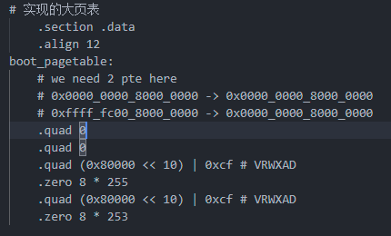
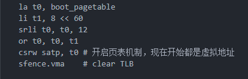

# 内存管理

## 内存设计

在rCore中，用户和内核采用独立的地址空间，这样当用户态和内核态数据互相访问数据时，需要切换地址空间，造成性能损耗大。所以考虑到减少切换开销，我们设计用户和内核共享地址空间。但是这又会引出一系列问题：
- 在共享空间中内核与用户地址如何放置与隔离
- 在QEUM上，内核入口在0x80200000，那么把低于0x80000000的地址可以用于用户空间的话，这样用户只有2G可以使用的空间，这显然不能充分发挥应用的性能

针对以上问题，我们对rCore做了一下的优化。

## 地址空间

参照linux中设计，因为在内存中栈空间是从上向下增长的，所以用户空间一般要求低于内核空间，这样可以避免用户空间中数据对内核空间造成影响。同时在rCore中，只是简单的对内核空间采用直接映射方式访问物理地址，这样只能把低于0x80000000的地址可以用于用户空间，会极大限制用户应用性能。

在实际os中，虚拟地址对应用内存的管理发挥了巨大作用，它让应用误以为整个地址空间都可以使用；同时由于页表机制，虽然在不同的应用有相同的虚拟地址，但是虚拟页面映射的物理页面并不相同，这样实现了不同应用地址空间的隔离。基于此，我们考虑到用虚拟地址方式重新设计地址空间。

总体思路就是将内核空间映射在虚拟地址的高地址，用户空间在低地址。但是由于在我们的操作系统之采用`RISC-V SV39`三级页表机制，64位的虚拟地址中，高25位必须与第39位的符号相同，所以内核地址空间最多只能分布在`[0xffff_ffc0_0000_0000, 0xffff_ffff_ffff_ffff]`；同理，用户空间为`[0x0, 0x0000_003f_ffff_ffff]`。中间的虚拟地址空间我们并不使用，这样我们就摆脱了2G空间的限制，同时又隔离了用户空间和内核空间。

### 实现

在rCore基础上，修改内核入口地址，将`linker-qemu.ld`中`BASE_ADDRESS`设置为`0xffffffc080200000`，这样内核就会被载入到内存的高地址中。这里我们采用直接映射方式，所以在原来基础上只需要加上一个偏移`0xffff_ffc0_0000_0000`就能实现内核虚拟地址->物理地址的映射。但是这样的话，由于在QEUM上，内核入口物理地址在`0x80200000`，当我们将其放置在`0xffffffc080200000`的虚拟地址后，需要手动建立一个页表实现`0xffffffc080200000`虚拟地址到物理地址`0x80200000`的映射，这样才能实现pc正确的地址访问。幸运的是在RISCV中允许我们建立一个大页表，将虚拟地址`0xffffffc080200000`和`0x80200000`同时写在一张表中。所以在真正执行`rust_main`前，我们要先打开satp寄存器的页表机制，同时手写大页表如下：

开启页表机制后，这时候我们需要先利用跳板函数`jump_helper`设置sp到内核栈位置，然后才真正调用`rust_main`，这样就真正进入了内核流程。
